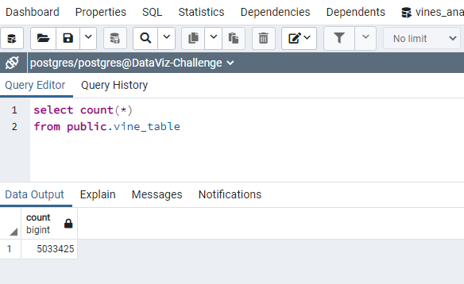

# Amazon Vine Analysis

Since your work with Jennifer on the SellBy project was so successful, you’ve been tasked with another, larger project: analyzing Amazon reviews written by members of the paid Amazon Vine program. The Amazon Vine program is a service that allows manufacturers and publishers to receive reviews for their products. Companies like SellBy pay a small fee to Amazon and provide products to Amazon Vine members, who are then required to publish a review.

We have been asked to analyze one of approximately 50 datasets. Each one contains reviews of a specific product, from clothing apparel to wireless products. 

We will pick one of these datasets and perform the ETL process to extract the dataset, transform the data, connect to an AWS RDS instance, and load the transformed data into a postgresql database. Once the dataset is loaded into RDS tables we will analyze the data for favorable or preferential reviews from Vine members. 

## Dataset Chosen

The first task that we were asked to do is select one of the datasets for amazon reviews. The dataset chosen for this analysis is the dataset dealing with Mobile Apps reviews.

https://s3.amazonaws.com/amazon-reviews-pds/tsv/amazon_reviews_us_Mobile_Apps_v1_00.tsv.gz

The dataset was loaded into a dataframe. The loaded dataframe looks like:

The loaded dataframe is the processed by the ETL pipeline that was developed to separate the data into four different database tables. The tables:

<ul>
<li>Customers</li>
<li>Products</li>
<li>Review</li>
<li>Vine Membership</li>
</ul>

Are set up to aid in analysis of the dataset.

## ETL Pipeline

After the ETL pipeline runs, we have four data tables in the database.

### Customer table

The customer table produced from the Mobile Apps dataset contained 2,356,753 customers.

The data produced for those customers looks like:

### Product table

The product table produced from the Mobile Apps dataset contained 127,113 products.

The data produced for those products looks like:

### Review table

The review table produced from the Mobile Apps dataset contained 5,033,425 products.

The data produced for those reviews looks like:

### Vine table

The vine membership table produced from the Mobile Apps dataset contained 5,033,425 products.

The data produced for those vine memberships looks like:

## Vine review

Once the ETL process was done and the database tables had been built, the analysis of the reviews by vine members could proceed.

### Sort out Vine Members

The first part of the analysis was to determine the reviews which were provided by Vine members

In the mobile apps dataset selected, there was only one review provided by a Vine member.

The data for the reviews from non Vine members looks like:

### Sort out Helpful Reviews

The next step was to find the 5 star reviews which also had 20 or more votes as a helpful review.

Since the only Vine member identified review was a 3 star review, there was no data found in this portion of the analysis

The data for the non Vine members looks like:

### Sort out Star Ratings

The final ask was to find the the distribution of star rated reviews in the dataset. First we need to find the counts of each star rating.

Then we need to figure out the percentage of the whole for each star rating.

##Summary

The Mobile Apps dataset had only one Vine member review. It had no bearing on the distribution of the star ratings for all the review in the dataset.  

One extra piece of analysis that would be helpful to our customer would be star rating by product parent. By joining the vine table to the review table, we could do a star rating by parent, or mobile app developer in this case. This would let our customers know an overall quality of the developer.   